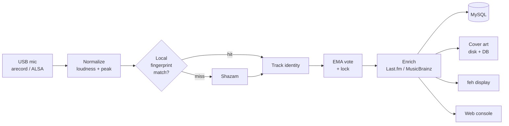

# musicguru

**Continuous music recognition, logging, and browsing.**

musicguru listens to the music playing in a room through a USB microphone,
identifies each track, and keeps a searchable, self-healing history of everything
it hears. It was built to sit on a Raspberry Pi with a USB mic, drive a small
album-art display, and serve a web console you can browse from anywhere on the
LAN — but it runs anywhere Python, ALSA, and MySQL do.

Recognition is backed by a **local fingerprint cache**, so once a song has been
heard it's re-identified on-device without a network call. Metadata and cover
art are stored durably, integrations (Plex, Last.fm, Home Assistant, Prometheus)
are one env-var away, and the whole thing degrades gracefully: with nothing but a
database configured it still records, displays, and serves the archive.

A complete, always-current reference is served in-app at **`/docs`**.

## Screenshots

The live console — now playing, and the recognized-tracks list with in-library badges:


The stats overview — totals, playlist actions, and the date-range filter:


Listening insights — when you listen, plus top artists, albums, and tracks:


---

## Table of contents

- [How it works](#how-it-works)
- [Feature tour](#feature-tour)
- [Requirements](#requirements)
- [Installation](#installation)
- [Configuration](#configuration)
- [Running](#running)
- [The web console](#the-web-console)
- [Authentication](#authentication)
- [HTTP API](#http-api)
- [Database](#database)
- [Integrations](#integrations)
- [Durability & operations](#durability--operations)
- [Project layout](#project-layout)
- [Development & tests](#development--tests)
- [Troubleshooting](#troubleshooting)
- [License](#license)

---

## How it works

The capture loop runs continuously and overlaps recording with recognition, so
there's no dead air between segments:



1. **Capture & normalize.** A short segment (`AR_RECORD_DURATION` seconds) is
   recorded from `AR_ALSA_DEVICE` and loudness-normalized with a clamped peak so
   quiet passages don't clip. Two buffers ping-pong — the next segment records
   while the current one is being identified.
2. **Identify.** The segment is fingerprinted with Chromaprint and matched
   against tracks heard before. On a hit, the cached identity is used and
   **Shazam is never called**. On a miss (or when `fpcalc` isn't installed) it
   falls back to Shazam.
3. **Vote & lock.** Results feed an exponential-moving-average vote keyed on a
   *normalized* identity — accents folded, `(Remaster)` / `[Live]` / `feat.`
   variants collapsed — so spelling variants don't split the vote. A track
   "locks" once its weight crosses `AR_EMA_THRESHOLD`, which rejects one-off
   misrecognitions.
4. **Enrich.** On lock, album/genre/duration that Shazam left blank are filled
   from Last.fm, with a MusicBrainz fallback purely for duration (which is what
   makes the now-playing progress dial work). Local-cache hits already carry
   this and skip the lookup.
5. **Record & show.** The play is written to MySQL (timestamped in UTC), pushed
   to now-playing, optionally scrobbled/published, and the art is shown on the
   display and served to the console.

When the room goes quiet for `AR_SILENCE_RESET_SEGMENTS` consecutive segments,
now-playing clears, the vote resets, and the play just ended is finalized (its
`listened_seconds` recorded) — so the same song heard again after a real gap is
logged as a distinct play.

### Local recognition, in a bit more detail

Every segment Shazam identifies is fingerprinted with **Chromaprint** (the
`fpcalc` tool behind AcoustID/MusicBrainz) and stored against that track. Later
segments are fingerprinted and matched locally first. Matching stays cheap as the
library grows via an inverted index: a query only bit-compares against a handful
of candidate fingerprints instead of the whole corpus. Up to
`AR_FP_MAX_PER_TRACK` reference fingerprints are kept per track (different parts
of a song fingerprint differently, so several references raise the hit rate over
time), and the acceptance bar is `AR_FP_MATCH_THRESHOLD` — same audio scores
~0.9+, unrelated audio ~0.5, so the default is deliberately conservative and
uncertain segments fall back to Shazam rather than risk a mislabel.

It's a **cache, not a replacement**: a brand-new track, or a part of a song not
yet fingerprinted, still needs Shazam once. Without `fpcalc` installed the whole
mechanism stays off automatically and every segment goes to Shazam, exactly as it
did before.

---

## Feature tour

- **Recognition** — Shazam + a local Chromaprint cache, EMA vote-smoothing, and
  identity normalization that folds remaster/live/`feat.` variants together.
- **Metadata enrichment** — Last.fm album/genre/duration with a MusicBrainz
  duration fallback; every lookup is cached.
- **Durable cover art** — covers are re-encoded to capped JPEGs and stored in the
  database *and* a disk cache. The console and the physical display both resolve
  disk → DB → one-time download, so art is never re-fetched from the internet
  after it's first seen (Shazam's CDN links expire; the archive won't go blank).
- **Web console** — now-playing panel with a live progress dial, a full
  searchable/sortable archive, want-list, and a rich stats page.
- **Self-healing corrections** — one click relabels a misheard track, fixes every
  past play that matched the wrong identity, and remembers the mapping so future
  recognitions are corrected before they're ever logged wrong.
- **Streaming deep-links** — every track links out to Spotify, Apple Music, and
  TIDAL search.
- **Plex** — check each track against your library, stream in-library tracks
  through a token-free proxy, export M3U playlists, and create/append real Plex
  audio playlists.
- **Last.fm scrobbling**, **Home Assistant now-playing** (webhook + optional
  MQTT), a **silence watchdog** with alerts, and a **Prometheus** `/metrics`
  endpoint.
- **Login** — optional username/password auth (signed-cookie sessions) plus a
  token path for machine callers.
- **Resilient** — failed DB writes are spooled to disk and replayed in order;
  schema migrations run automatically at startup.

---

## Requirements

**System packages**

| Package | Why |
| --- | --- |
| `alsa-utils` | `arecord` capture from the USB microphone |
| `ffmpeg` | audio decoding for `pydub` |
| `libchromaprint-tools` | `fpcalc`, for local recognition (optional but recommended) |
| `feh` + a TrueType font | the physical album-art display (optional) |
| MySQL **or** MariaDB | the archive |

**Python** ≥ 3.10 (uses `int.bit_count()`, `X | None` types), plus the packages
in [`requirements.txt`](requirements.txt): Flask, mysql-connector-python,
requests, Pillow, pydub, shazamio (and optionally paho-mqtt).

---

## Installation

```bash
git clone https://github.com/michaelosten/musicguru.git
cd musicguru

# system deps (Debian / Ubuntu / Raspberry Pi OS)
sudo apt install alsa-utils ffmpeg libchromaprint-tools feh \
                 fonts-dejavu-core default-mysql-server

# python deps (a venv is recommended)
python3 -m venv .venv && source .venv/bin/activate
pip install -r requirements.txt
```

Create the database and a user:

```sql
CREATE DATABASE music_log CHARACTER SET utf8mb4;
CREATE USER 'musicuser'@'localhost' IDENTIFIED BY 'choose-a-password';
GRANT ALL PRIVILEGES ON music_log.* TO 'musicuser'@'localhost';
FLUSH PRIVILEGES;
```

All tables and columns are created and migrated automatically on first run — you
do not need to load a schema file.

---

## Configuration

Everything is set through `AR_*` environment variables. **The only strictly
required one is `AR_DB_PASSWORD`.** Copy `.env.example`, fill in what you need,
and load it before launch (systemd `EnvironmentFile=`, `python-dotenv`, or a
plain `set -a; . ./.env; set +a`). The complete annotated list lives in
[`audio_recognition/config.py`](audio_recognition/config.py); the most useful
variables are below.

### Core & capture

| Variable | Default | Meaning |
| --- | --- | --- |
| `AR_DB_PASSWORD` | *(required)* | MySQL password |
| `AR_DB_HOST` / `AR_DB_PORT` | `localhost` / `3306` | MySQL host/port |
| `AR_DB_USER` / `AR_DB_NAME` | `musicuser` / `music_log` | MySQL user/database |
| `AR_ALSA_DEVICE` | `hw:1,0` | ALSA capture device (`arecord -l` to find it) |
| `AR_RECORD_DURATION` | `6` | Seconds per segment |
| `AR_SAMPLE_RATE` | `44100` | Capture sample rate |
| `AR_SILENCE_THRESHOLD_DB` | `-45` | Below this dBFS a segment is silence |
| `AR_SILENCE_RESET_SEGMENTS` | `5` | Silent segments before now-playing clears |

### Recognition & enrichment

| Variable | Default | Meaning |
| --- | --- | --- |
| `AR_LOCAL_RECOGNITION` | `1` | Try the fingerprint cache before Shazam |
| `AR_FP_MATCH_THRESHOLD` | `0.78` | Similarity (0–1) to accept a local match |
| `AR_FP_MAX_PER_TRACK` | `8` | Reference fingerprints kept per track |
| `AR_FP_LENGTH_SEC` | `10` | Seconds `fpcalc` hashes per segment |
| `AR_SHAZAM_TIMEOUT` | `10` | Shazam request timeout (s) |
| `AR_EMA_ALPHA` / `AR_EMA_THRESHOLD` | `0.5` / `0.7` | Vote smoothing / lock threshold |
| `AR_ENRICH` | `1` | Fill album/genre/duration on lock (needs `AR_LASTFM_API_KEY`) |
| `AR_ENRICH_MUSICBRAINZ` | `1` | MusicBrainz duration fallback |
| `AR_LASTFM_API_KEY` | *(unset)* | Last.fm key for enrichment + scrobbling |

### Cover art & display

| Variable | Default | Meaning |
| --- | --- | --- |
| `AR_COVER_CACHE` | `1` | Enable the cover cache |
| `AR_COVER_DB` | `1` | Also store covers in the database |
| `AR_COVER_MAX_PX` | `500` | Max cover edge (px) |
| `AR_DISPLAY_ENABLED` | `1` | Drive the `feh` display |
| `AR_DISPLAY_W` / `AR_DISPLAY_H` | `800` / `480` | Display geometry |
| `AR_FONT_PATH` | DejaVu Sans Bold | Font for text fallback slides |

### Web & login

| Variable | Default | Meaning |
| --- | --- | --- |
| `AR_FLASK_HOST` / `AR_FLASK_PORT` | `127.0.0.1` / `8000` | Console bind address/port |
| `AR_WEB_USER` | `admin` | Login username |
| `AR_WEB_PASSWORD_HASH` | *(unset)* | Hashed password (preferred) |
| `AR_WEB_PASSWORD` | *(unset)* | Plaintext password (alternative) |
| `AR_WEB_SECRET_KEY` | *(derived)* | Session-cookie signing key; set to rotate all sessions |
| `AR_WEB_SESSION_HOURS` | `720` | Login lifetime (0 = until browser closes) |
| `AR_WEB_TOKEN` | *(unset)* | Shared token for API/machine access |

### Integrations (all optional)

| Variable | Default | Meaning |
| --- | --- | --- |
| `AR_PLEX_BASE_URL` / `AR_PLEX_TOKEN` | *(unset)* | Plex server + token |
| `AR_SCROBBLE` | `0` | Enable Last.fm scrobbling |
| `AR_LASTFM_SECRET` / `AR_LASTFM_SESSION_KEY` | *(unset)* | Scrobble credentials |
| `AR_NOWPLAYING_WEBHOOK` | *(unset)* | JSON now-playing webhook (e.g. Home Assistant) |
| `AR_MQTT_HOST` / `AR_MQTT_TOPIC` | *(unset)* / `audio_recognition/now_playing` | MQTT (needs paho-mqtt) |
| `AR_WATCHDOG_SILENCE_MIN` | `0` | Alert after N silent minutes during active hours (0 = off) |
| `AR_ACTIVE_HOURS` | `0-24` | Local hours the watchdog is armed (e.g. `8-23`) |
| `AR_NOTIFY_URL` | *(unset)* | Alert webhook or ntfy topic URL |

---

## Running

```bash
python -m audio_recognition        # recognizer + web console
# console at http://127.0.0.1:8000/
```

For unattended operation, run it under systemd with an `EnvironmentFile=` holding
the `AR_*` variables:

```ini
# /etc/systemd/system/musicguru.service
[Unit]
Description=musicguru — music recognition
After=network-online.target mysql.service

[Service]
Type=simple
User=pi
WorkingDirectory=/home/pi/musicguru
EnvironmentFile=/home/pi/musicguru/.env
ExecStart=/home/pi/musicguru/.venv/bin/python -m audio_recognition
Restart=on-failure
RestartSec=5

[Install]
WantedBy=multi-user.target
```

```bash
sudo systemctl enable --now musicguru
journalctl -u musicguru -f
```

---

## The web console

- **Now Playing** — album art, title, artist, album/genre, and a context line
  (*play #N · last heard <date>*). The dial fills against the track duration and
  sweeps in a "scanning" state when the duration is unknown. The signal lamp
  lights when audio is currently present.
- **Tracks** — the full archive with infinite scroll. Search title/artist/album,
  filter by genre, sort by recently played / most played / artist / title /
  album / first heard. **Merge variants** folds remaster/live/`feat.` versions
  into one row. Each row shows Plex-library presence, streaming deep-links, and a
  **Fix** button; rows with an album reveal album trivia.
- **History** — chronological play-by-play, grouped by day.
- **Want-list** — distinct tracks you've heard that are *not* in your Plex
  library, with streaming links and a **Copy list** button.
- **Stats** — totals (plays, tracks, artists, albums, hours) plus **match rate**
  (7-day recognition rate), current **day streak**, listening **sessions**, a
  24-hour listening clock weighted by minutes, top artists/albums/tracks, genre
  breakdown, artists first heard this week, and a year-long calendar heatmap.
- **Selection actions** — select rows (or "all matching") to **Download** an M3U
  of the matching in-library tracks, or **Add to a Plex playlist**.

---

## Authentication

The console binds to loopback with no auth by default. Two mechanisms can be
layered on and coexist:

**Interactive login** (for humans) — set a password and a `/login` form guards
every page via signed-cookie sessions:

```bash
python -m audio_recognition.webapp.auth 'your password'   # prints a hash
# then, e.g. in your .env:
AR_WEB_USER=admin
AR_WEB_PASSWORD_HASH='scrypt:...'      # paste the printed hash
```

**Token** (for machines) — `AR_WEB_TOKEN` is accepted as an `X-Auth-Token` header
or `?token=` query param, so Prometheus/health scrapers can authenticate without
a session. A request is authorized if it has *either* a valid session *or* a
valid token.

To expose the console on a LAN, put a reverse proxy in front **and** enable one of
the above.

---

## HTTP API

All routes honor the optional auth token (`?token=` or `X-Auth-Token`).

| Method | Path | Purpose |
| --- | --- | --- |
| GET | `/` | Web console |
| GET | `/docs` | In-app documentation |
| GET | `/login`, `/logout` | Session login flow |
| GET | `/api/now_playing` | Current track + context |
| GET | `/archive_data` | Tracks view (search/sort/merge, paged) |
| GET | `/api/history` | Chronological plays (paged) |
| GET | `/api/genres` | Genre filter options |
| GET | `/api/stats` | All statistics |
| GET | `/api/matching_ids` | IDs matching current filters (select-all) |
| POST | `/api/in_library` | Batch Plex library check |
| POST | `/api/fix` | Relabel + remember a correction |
| GET | `/api/wantlist` | Heard-but-not-in-Plex tracks |
| DELETE | `/api/play/<id>` | Delete one play |
| POST | `/api/forget` | Forget a track (all its plays) |
| POST | `/download_playlist` | M3U of selected in-library tracks |
| POST | `/create_plex_playlist` | Create/append a Plex audio playlist |
| GET | `/stream/<id>` | Token-free Plex stream proxy |
| GET | `/cover/<id>`, `/cover/now` | Cover art (disk → DB → source) |
| GET | `/album_trivia` | Album trivia for a row |
| GET | `/healthz` | Liveness: signal age, recognition rate, Plex |
| GET | `/metrics` | Prometheus metrics |

`/metrics` exposes `ar_plays_total`, `ar_tracks_total`, `ar_recognition_rate`,
`ar_signal_age_seconds`, `ar_now_playing`, and `ar_up`.

---

## Database

Created and migrated automatically at startup:

| Table | Holds |
| --- | --- |
| `recognized_songs` | one row per play (title, artist, album, genre, duration, cover_url, `listened_seconds`, UTC timestamp) |
| `corrections` | learned raw → canonical relabels |
| `segment_counts` | matched/missed segments per day-hour, for the recognition rate |
| `known_tracks` | canonical metadata per identity, for local-cache hits |
| `fingerprints` | Chromaprint fingerprints mapping audio back to `known_tracks` |
| `cover_blobs` | re-encoded cover art, keyed by a hash of the source URL |

Plays are timestamped with `UTC_TIMESTAMP()`, so rows are unambiguous regardless
of the server's time zone.

---

## Integrations

Each is inert until its variables are set.

- **Plex** — with `AR_PLEX_BASE_URL` + `AR_PLEX_TOKEN`, the console checks tracks
  against your library, streams in-library tracks through a token-free
  `/stream/<id>` proxy, exports M3U playlists, and creates/append Plex audio
  playlists.
- **Last.fm scrobbling** — set `AR_SCROBBLE=1` plus `AR_LASTFM_API_KEY`,
  `AR_LASTFM_SECRET`, and a one-time session key obtained with
  `python -m audio_recognition.scrobble`. A play scrobbles once it has run past
  `AR_SCROBBLE_MIN_SECONDS` and Last.fm's half-track / 4-minute rule.
- **Home Assistant / now-playing** — `AR_NOWPLAYING_WEBHOOK` receives the current
  track as JSON on every change; with paho-mqtt installed and `AR_MQTT_HOST` set,
  a retained message is also published to `AR_MQTT_TOPIC`.
- **Watchdog alerts** — `AR_WATCHDOG_SILENCE_MIN > 0` fires a one-shot alert to
  `AR_NOTIFY_URL` (JSON webhook or ntfy topic) when no audio is seen for that many
  minutes during `AR_ACTIVE_HOURS` — catching an unplugged stereo or dead device.
- **Prometheus** — scrape `/metrics` for Grafana dashboards and alerting.

---

## Durability & operations

- **DB outage spool.** If the database is unavailable when a play is recorded,
  the play is appended to a local JSONL spool (`AR_DB_SPOOL_FILE`) and replayed —
  in order, with its original timestamp — on the next successful write, so a
  MySQL restart mid-session doesn't punch holes in the history.
- **Auto-migrations.** New columns and tables are created if missing at startup;
  upgrading is just pulling and restarting.
- **Graceful degradation.** Missing `fpcalc`, missing paho-mqtt, unset
  credentials — each disables only its own feature and logs a note.

---

## Project layout

```
audio_recognition/
├── main.py              # capture → recognize → vote → enrich → record loop
├── config.py            # every AR_* setting, annotated
├── audio/capture.py     # arecord + normalization
├── recognize/           # Shazam client + Track model
├── fingerprint.py       # local Chromaprint cache + inverted index
├── enrich.py            # Last.fm / MusicBrainz metadata
├── corrections.py       # learned relabels
├── covers.py            # disk + DB cover cache
├── storage/db.py        # MySQL access, schema, spool/replay
├── plex/client.py       # library check, streaming, playlists
├── scrobble.py          # Last.fm scrobbling
├── publish.py           # Home Assistant webhook / MQTT
├── notify.py            # watchdog alerts
├── display/image_ops.py # feh display rendering
├── state.py, ema_state.py
└── webapp/
    ├── __init__.py      # app factory + auth gate
    ├── auth.py          # login/token helpers + password-hash CLI
    ├── routes.py        # all HTTP routes
    ├── templates/       # index.html, docs.html, login.html
    └── static/style.css
tests/test_offline.py    # offline logic tests
```

---

## Development & tests

Logic-level tests run offline — no live database, Shazam, `fpcalc`, or network
required (external calls are stubbed/monkeypatched):

```bash
python tests/test_offline.py
```

They cover fingerprint similarity and the inverted-index match, cover-art DB
rehydration, the login/session/token matrix, Last.fm signature construction,
correction normalization/relabel, scrobble thresholds, and DB-spool replay
ordering.

---

## Troubleshooting

- **No audio / silence forever** — check `arecord -l` and set `AR_ALSA_DEVICE`
  to the right `hw:CARD,DEVICE`. Test with
  `arecord -D hw:1,0 -d 5 -f cd /tmp/t.wav && aplay /tmp/t.wav`.
- **Local recognition never hits** — confirm `which fpcalc` resolves; install
  `libchromaprint-tools` if not. Every track needs one Shazam identification
  before it can be recognized locally.
- **Progress dial stuck at 0:00** — duration is missing; enable enrichment
  (`AR_ENRICH=1` + `AR_LASTFM_API_KEY`).
- **Covers eventually blank** — make sure `AR_COVER_DB=1` so art survives a lost
  disk cache; the DB copy is the durable source of truth.
- **Console returns 401** — auth is enabled; log in at `/login`, or send the
  token as `?token=` / `X-Auth-Token`.

---

## License

MIT — see [LICENSE](LICENSE).
